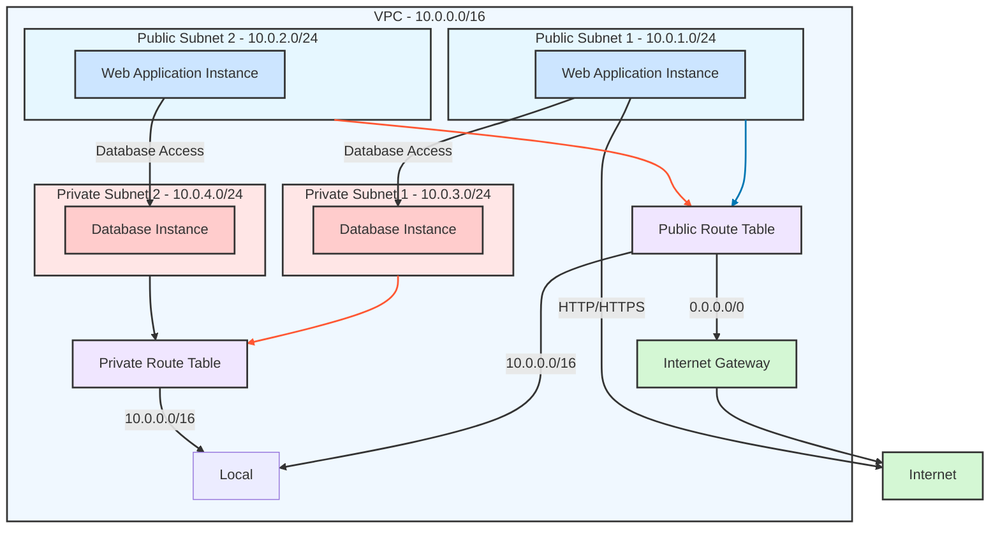

# Virtual Private Cloud 

 A VPC is your own private cloud/network within the cloud. It allows you to launch AWS resources, such as EC2 instances, in a private, customisable networking environment.

## Summary of What’s Happening
The VPC is divided into public and private subnets.

Web application instances in the public subnets can access the internet and communicate with database instances in the private subnets.

Database instances are isolated in the private subnets and cannot access the internet directly.

The route tables control traffic flow:

Public subnets use the Internet Gateway for internet access.

Private subnets only allow internal VPC communication via the local route.

The Internet Gateway enables internet access for resources in the public subnets.


# Why Use a VPC (Virtual Private Cloud)?  

A **VPC (Virtual Private Cloud)** provides a **secure, customisable, and isolated** networking environment in AWS. Here are three key reasons to use one:  

## 1️⃣ Security & Network Isolation  
- Keeps your cloud resources **separate from other AWS users**.  
- Uses **Security Groups & Network ACLs (NACLs)** to control inbound/outbound traffic.  
- Supports **public and private subnets** for better security (e.g., private databases).  

## 2️⃣ Full Control Over Networking  
- Allows **custom IP ranges (CIDR blocks)** for better network organization.  
- Configurable **Route Tables, Internet Gateways, and NAT Gateways**.  
- Supports **multi-AZ deployments** for high availability and redundancy.  

## 3️⃣ Secure Internet & On-Prem Connectivity  
- **Internet Gateway (IGW)** enables internet access for public resources.  
- **NAT Gateway** allows private instances to access the internet securely.  
- **VPC Peering & VPN** enables secure connections between VPCs or on-prem networks.  

  
A VPC is **essential for securing, scaling, and managing cloud infrastructure** efficiently. Whether you’re hosting a simple web app or a complex enterprise system, **a VPC ensures a safe and structured AWS environment**.  


# Top 3 Benefits of a VPC for a Business

1. **Enhanced Security**: VPC offers a secure, isolated environment with full control over security policies, using tools like Security Groups and Network ACLs to protect sensitive data and resources.

2. **Network Control**: Businesses have full control over their networking setup, including IP address ranges, subnets, and route tables, allowing for a tailored network design that meets specific needs.

3. **High Availability and Redundancy**: By leveraging multi-AZ (Availability Zone) deployments, VPC ensures fault tolerance, high availability, and improved disaster recovery for business-critical applications.


# Top 3 Ways VPCs Help DevOps  

## Secure and Isolated Environments  
- VPCs allow DevOps teams to create **logically isolated** environments for development, testing, and production.  
- **Security Groups & Network ACLs (NACLs)** ensure controlled access to resources.  
- Helps prevent accidental exposure of internal services to the internet.  

## Scalable and Flexible Networking  
- Custom **IP address ranges (CIDR blocks)** for better organization and scaling.  
- Support for **multi-AZ deployments** ensures high availability.  
- Allows **fine-grained control** over network configurations, including **subnets, route tables, and gateways**.  

## Secure CI/CD and Automation Workflows  
- Enables **secure communication** between CI/CD pipelines and AWS services.  
- Can integrate with **VPC endpoints** for private, high-speed access to AWS services (e.g., S3, DynamoDB).  
- Supports **bastion hosts and VPNs** for secure access to internal environments.  


## Why did AWS need to implement VPCs?
AWS implemented Virtual Private Cloud (VPC) to provide customers with greater control, security, and flexibility over their cloud networking environment. When AWS first launched, all resources (like EC2 instances) existed in a shared networking space, which posed challenges in terms of isolation, security, and customization.

# Key Words : 

# Subnet 

A subnet, subnetwork, is a smaller portion of a larger network, tpyically a VPC. The subnet divides a VPC into smaller segments, each with its own range of IP addresses. 

You can have a public or a private subnet. A public subnet communicates directly with the internet through an internet gateway. 

A private subnet contains resources that doesn't interact with the internet but often holds databases. 

# Classless Inter-Domain Routing (CIDR)

Notation for describing blocks of IP addresses 

CIDR helps us define the IP address range for our VPC. we need to ensure that the CIDR block we choose provides enough addresses to all resources we plan to use like EC2 instances, load balancers and databases, both now and in the future. 

# Public Subnet
A public subnet is a subnet that has a route to the Internet Gateway (IGW), allowing resources within it (e.g., web servers) to communicate directly with the internet. It is typically used for resources that need to be publicly accessible.

# Private Subnet
A private subnet is a subnet that does not have a direct route to the internet. Resources in a private subnet (e.g., databases) can only communicate within the VPC or through a NAT Gateway for limited outbound internet access. It is used for resources that should not be exposed to the public internet.

# Internet Gateway  
The IGW acts like bridge for resources in your VPC to access the internet and for the internet to access resources in your VPC. 

# Route Table
A route table is a set of rules (called routes) that determine where network traffic from your subnet or VPC is directed. It acts as a traffic controller.


You can use the following link to help you visualise CIDR blocks further : [IP/CIDR Calculator](https://cidr.xyz/)  

<br/>
<br/>

# How to set up a VPC 

### Step One : 

- first log into your AWS account and search VPC, click create vpc indicated by the big orange button 


- AWS allows you to quickly make a vpc with some configurations already in place but for this tutorial, Im going to make it from the beginning. 

### Step two : 
### page 1
- Once we are on the correct landing page, we want to click VPC only
- we want to proivde a name : **aaron-first-vpc**
- next we want to make sure IPv4 CIDR manual input is selected 
- IPv4 CIDR : 10.0.0.0/16 (overall IP range for the VPC)
- No IPv6 CIDR block
- tag should auto generate 

10.0.0.0 is the starting IP address in the CIDR block. 
/16 is the subnet mask which specifies how many bits are used for the network portion of the address. 


we dont select IPv6 because the application we are running doesn't require IPv6 features so there is no need to congiure. 

once we are happy we can click create VPC 


# How to make Subnets 

- On the side just under **Your VPCs** we can see subnets, click that and click **create subnet** 


- Next we want to select the vpc we just created for the first field 
- First we are creating a public subnet, so lets name it **public_subnet** 
- Next we select our Availability Zone, 1a 
- IPv4 subnet CIDR block = 10.0.2.0/24
- tag should auto generate 

- We want to create another subnet, this will be our private subnet

- name = private-subnet
- AZ = 1b
- IPv4 Subnet CIDR block = 10.0.3.0/24
- tag auto generates 

I will explain the concept for the public IP : 

with the following ip : 10.0.2.0/24, you get 256 Ip addresses but only 254 are usable, why? 

The network address 10.0.2.0 is reserved which identifies the subnet itself 

The broadcast address 10.0.2.255 is reserved which is used to send messages to all devices in the subnet. 

so from 10.0.2.1 to 10.0.2.254 are usable 

once we are happy we can click **create subnet**


# How to create a Internet Gateway 

The purpose of creating an Internet Gateway is to enable communication between resources in your VPC and the internet. 

- we now want to navigate to **Internet Gateways**, click **create internet gateway**:


- we just need to provide a name which auto generates a tag and we simply click create


- we need to attach our ig to our vpc and should be promted like so in the green banner : 


- we can select our vpc and click **attach internet gateway**


# How to create Route Tables 

- we want to head over to route tables and click create route table


- we want to input a name and select our VPC, click create


- we want click Actions and edit subnet association to create that link 


- click the public subnet and click save association, we dont want to allow internet traffic to enter our private subnet 

- we can also see which subnet as a association, the private one doesn't which is good 


- we need to add a route to the internet gateway in the public route table 

- we are on the right landing page so we click routes and click edit routes 


- destination = 0.0.0.0/0  
- Target = Internet Gateway 
  click igw and there should be only one option to click 

Then click save changes 


## we want to check our current VPC set up 

- we can go back to **your VPCs**
- click your VPC ID


- Looking at the resource map we should see the correct connection and layout for the public and private subnet 


# Set up our deployment 

- Head over to EC2 and click instances and click launch Instances

- we are going to create our database first, when we create the app then the app can connect 

- provide a name 
- select your database AMI
- Instance type = t2.micro 
- provide your key pair 
- we want to edit network settings 

instead of picking the default vpc we are going to use the one we created 

- auto assign public ip = disabled 
- we are going to create a new security group 

provide a name 
we have the ssh default 
we want to add custom TPC for our mongoDB with the port being 27017

once we are happy we can click launch 


## Launch our app instance 

- provide a name 
- select my AMI for the app 
- Instance type = t2.micro 
- provide your key pair 
- edit network settings 

make sure to select your vpc and public subnet 

Enable Auto-assign public IP 

- create a security group 

provide a name 

ssh is default 
we want a custom TPC with the port 3000 for our app, source = 0.0.0.0/0
we want HTTP to allow web traffic, source = 0.0.0.0/0

- we want edit advance details 
- input our user data 
- we want to grab our mongoDB private IP for the export variable 
- This should start our app and connect the database automatically 

```GitBash
#!/bin/bash
 
sleep 30
 
cd /home/ubuntu
 
cd nodejs2-sparta-test-app-2025
 
cd app
 
export DB_HOST=mongodb://10.0.3.215:27017/posts
 
sudo npm install
 
node seeds/seed.js
 
pm2 start app.js
 
```

Click Launch Instance 


# Results 

- From our app instance we take the public IP and see if the app has launched 

we can see the home page is working and the database is working 


# Glossary

| **Term**                     | **Definition**                                                                                      |
|------------------------------|------------------------------------------------------------------------------------------------------|
| **VPC (Virtual Private Cloud)** | A logically isolated section of the AWS cloud where you can define and control a virtual network.    |
| **AWS**                       | Amazon Web Services, a cloud computing platform offering various services like computing, storage, and networking. |
| **EC2 instances**             | Virtual servers in AWS that allow you to run applications in the cloud.                             |
| **IP address ranges**         | A set of IP addresses assigned to a VPC to allocate resources within the network.                   |
| **Subnets**                   | Segments of a VPC’s IP address range used to organize resources based on security and operational needs. |
| **Route tables**              | Rules that determine where network traffic is directed within a VPC.                               |
| **Security settings**         | Configurations used to control access and protect resources within a VPC.                           |
| **Security Groups**           | Virtual firewalls that control inbound and outbound traffic for EC2 instances.                     |
| **Network ACLs (NACLs)**      | Network-level security mechanisms that control inbound and outbound traffic for subnets.           |
| **Public and private subnets**| Subnets within a VPC where public subnets allow internet access and private subnets restrict it.   |
| **CIDR blocks**               | IP address ranges specified for a VPC using Classless Inter-Domain Routing (CIDR) notation.         |
| **Route Tables**              | Configurations that define routing rules for directing network traffic.                            |
| **Internet Gateways (IGW)**   | A gateway that enables internet access for public resources in a VPC.                              |
| **NAT Gateways**              | Devices that allow private instances in a VPC to access the internet while keeping them private.    |
| **Multi-AZ deployments**      | The practice of distributing AWS resources across multiple Availability Zones to ensure high availability and redundancy. |
| **VPC Peering**               | A connection between two VPCs that allows them to route traffic to each other.                     |
| **VPN**                       | A secure private network connection over the internet, often used to connect on-premises networks to a VPC. |
| **Cloud infrastructure**      | The physical and virtual resources (e.g., servers, storage, networks) required to host and manage applications in the cloud. |

